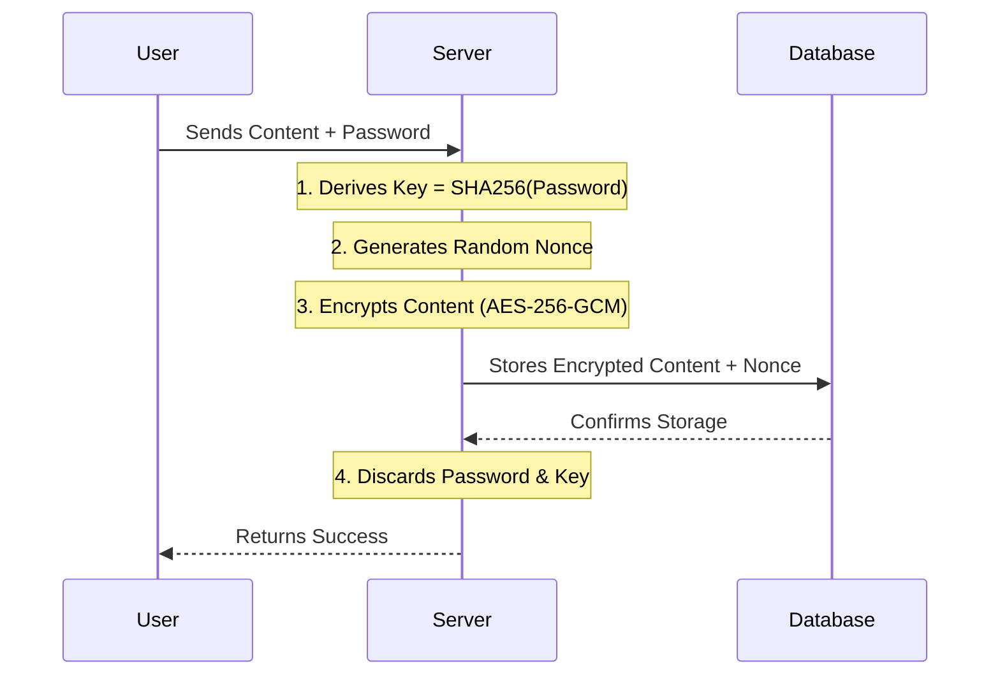
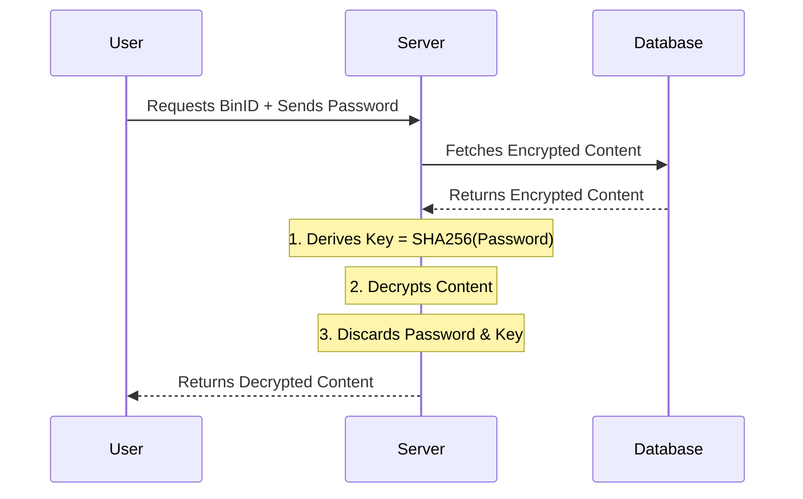

# ConfigBin

**Secure, Encrypted Configuration Storage Service.**

ConfigBin is a lightweight, zero-knowledge web service designed for securely storing and retrieving configuration files. It uses client-side password handling to ensure the server never stores the decryption key, making your data accessible only to those with the password.

## What is ConfigBin?

ConfigBin solves the problem of securely sharing and storing sensitive configuration data. Unlike traditional pastebins or key-value stores, ConfigBin ensures that the server operator cannot read your data.

**Real-world Use Cases:**

*   **CI/CD Secrets:** Store encrypted configuration files or secrets that your CI/CD pipelines can fetch and decrypt on the fly using a known password.
*   **Distributed App Config:** Centralize configuration for distributed applications where each instance fetches its config securely at startup.
*   **Secure Sharing:** Share sensitive configuration snippets (API keys, database credentials) between team members without risking exposure in chat logs or email.
*   **Config Backup:** Automatically backup configuration files with version history, allowing you to roll back to previous versions if needed.

## Features

-   **🔒 Zero-Knowledge Security**: Content is encrypted with AES-256-GCM. Passwords are never stored in the database.
-   **📜 Version Control**: Every update creates a new version. Access full history of changes.
-   **🌐 Dual Access**:
    -   **Web UI**: Clean interface for humans to create and edit configs.
    -   **HTTP API**: Simple JSON API for automated retrieval and updates.
-   **📦 Lightweight**: Built with Go, utilizing SQLite for storage. Single binary deployment.
-   **🐳 Container Ready**: Optimized Docker image based on Alpine.
-   **👀 Observable**: Built-in Prometheus metrics and health checks.

## Quick Start

The fastest way to get started is using Docker.

1.  **Run the container:**

    ```bash
    docker run -d -p 8080:8080 --name configbin korchasa/configbin:latest
    ```

2.  **Create a secure bin:**
    Open `http://localhost:8080` in your browser. The system will automatically generate a secure unique Bin ID and Password for you.

3.  **Retrieve via API:**
    Use the generated Bin ID and Password to fetch your config:

    ```bash
    curl -u "user:<YOUR_PASSWORD>" http://localhost:8080/api/v1/<BIN_ID>
    ```

## Installation and Running

### Running with Docker

For production use, you should mount a volume for the database to ensure data persistence.

```bash
docker run -d \
  -p 8080:8080 \
  -v $(pwd)/data:/app/var \
  -e SQLITE_PATH=/app/var/configbin.db \
  --name configbin \
  korchasa/configbin:latest
```

**Environment Variables:**

*   `LISTEN`: Address to listen on (default: `:8080`)
*   `SQLITE_PATH`: Path to the SQLite database file (default: `./var/configbin.db`)

### Running Locally

Prerequisites: Go 1.24+, Deno (for task runner).

1.  **Clone the repository:**
    ```bash
    git clone https://github.com/korchasa/ConfigBin.git
    cd ConfigBin
    ```

2.  **Initialize dependencies:**
    ```bash
    ./run.ts init
    ```

3.  **Start development server:**
    ```bash
    ./run.ts dev
    ```
    This will start the server on `http://localhost:8080`.

## Usage

### Web UI

1.  **Create:** Go to the home page. Copy the generated **Bin ID** and **Password**. Enter your config content and click "Save".
2.  **View/Decrypt:** To view a bin, navigate to `/<BIN_ID>`. You will be prompted for the password. The browser decrypts the content locally (or sends the password to the server for decryption in the current implementation, but the server does not store it).
3.  **Update:** While viewing a bin, you can edit the content and save it as a new version.

### API Usage

The API uses Basic Auth for authentication. The username can be anything (e.g., "user" or "token"), and the password must be the Bin's password.

#### Create a Bin

Currently, bin creation via API is not directly supported as it requires generating a valid UUID and Password. Use the Web UI to create a bin, or implement the creation logic client-side (generate UUID, encrypt content) if the API supports raw storage (check implementation). *Note: The current API focuses on retrieval.*

#### Get a Bin

Retrieve the latest version of a configuration.

```bash
curl -u "any-user:8f4b2c1d" http://localhost:8080/api/v1/a1b2c3d4-e5f6-7890-1234-567890abcdef
```

**Response:**

```json
{
  "success": true,
  "result": {
    "id": "a1b2c3d4-e5f6-7890-1234-567890abcdef",
    "data": "{\"database\": \"postgres://localhost:5432/mydb\"}",
    "version": 3,
    "created_at": "2023-10-27T10:00:00Z",
    "history": [
      { "version": 2, "created_at": "2023-10-26T15:30:00Z" },
      { "version": 1, "created_at": "2023-10-26T10:00:00Z" }
    ]
  }
}
```

*   `data`: The decrypted content of the configuration.
*   `version`: The current version number.
*   `history`: List of previous versions available for this bin.

## Operations

### Health Checks

The application provides standard health check endpoints for Kubernetes or load balancers:

*   `/liveness`: Returns 200 OK if the server is running.
*   `/readiness`: Returns 200 OK if the server is ready to accept traffic (DB is connected).

### Metrics

Prometheus metrics are available at `/metrics`. This includes Go runtime metrics and custom application metrics (e.g., number of bins created, request duration).

## Security Architecture

ConfigBin uses a zero-knowledge architecture where the server acts as a blind storage engine. While the server performs encryption and decryption operations, it never stores the password or the encryption keys.

### Why is it safe?

1.  **Ephemeral Key Usage**: The password is sent to the server only for the duration of the request. It is immediately hashed to derive an encryption key, used once, and then discarded from memory.
2.  **No Password Storage**: The database only stores encrypted data. There is no column for passwords or password hashes. Even if the database is stolen, the attackers cannot decrypt the data without the original passwords.
3.  **Standard Cryptography**: We use industry-standard AES-256-GCM encryption.

### Write Flow

When you create or update a bin:



### Read Flow

When you retrieve a bin:



### Security Recommendations

*   **HTTPS is Mandatory**: Since the password is sent to the server, you **must** run ConfigBin behind HTTPS (TLS) to prevent man-in-the-middle attacks.
*   **Password Management**: You are responsible for managing your passwords. If you lose a password, the data is unrecoverable.
*   **Data Persistence**: Ensure the SQLite database file is stored on a persistent volume. If the container is destroyed without a mounted volume, all data will be lost.

## License

MIT
